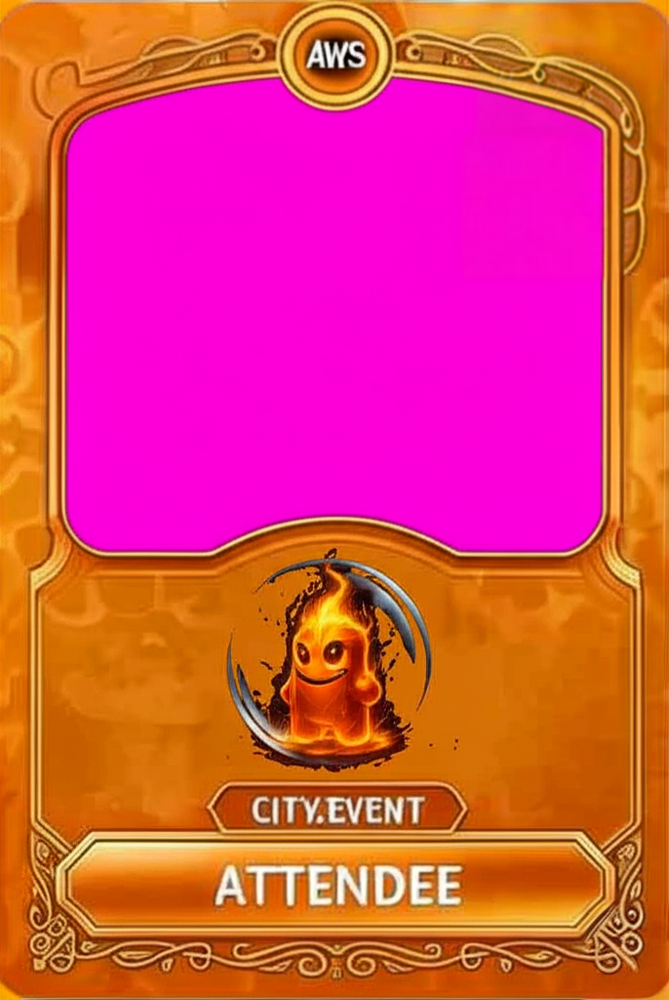

# SnapMagic 🎴✨

> **AI-Powered Trading Card Generation Platform for AWS Events**  
> Transform any event into an unforgettable experience with personalized AI-generated trading cards and videos.

[](https://aws.amazon.com/)
[](https://aws.amazon.com/bedrock/)
[](https://aws.amazon.com/cdk/)
[](LICENSE)

## 🚀 What is SnapMagic?

SnapMagic revolutionizes event engagement by generating professional trading cards and videos using Amazon Bedrock's Nova Canvas and Nova Reel models. Built for AWS events like re:Invent, customer summits, and partner gatherings.

**💰 Cost**: Just $0.49 per participant (vs $50-100 traditional engagement)  
**⚡ Speed**: Cards generated in under 30 seconds  
**📈 ROI**: 10,000%+ improvement over traditional event activities

## 🎯 Key Features

- **🎨 AI-Powered Generation**: Amazon Bedrock Nova Canvas creates stunning trading cards
- **🎬 Video Creation**: Nova Reel brings cards to life with animated videos  
- **⚡ Serverless Architecture**: Zero server management, infinite scalability
- **🔐 Event-Ready Auth**: JWT-based authentication with demo credentials
- **📱 Mobile Optimized**: Works seamlessly on all devices
- **💾 Instant Download**: High-quality PNG and MP4 exports
- **🏗️ Well-Architected**: Built following all 6 AWS pillars

## 🏗️ Architecture

```
Frontend (Vanilla JS) → API Gateway → Lambda (Python) → Bedrock → S3
                                   ↓
                              CloudWatch Logs
```

### Core AWS Services
- **Amazon Bedrock**: Nova Canvas (image) + Nova Reel (video) generation
- **AWS Lambda**: Serverless compute for card/video processing
- **API Gateway**: RESTful API with CORS support
- **Amazon S3**: Asset storage and static website hosting
- **AWS Amplify**: Frontend deployment and hosting
- **CloudWatch**: Monitoring and logging

## 📁 Project Structure

```
SnapMagic/
├── 📁 backend/
│   ├── requirements.txt            # Python dependencies
│   └── src/                        # Source code
│       ├── lambda_handler.py       # Main Lambda handler
│       ├── auth_simple.py          # JWT authentication
│       ├── card_generator.py       # Bedrock Nova Canvas integration
│       ├── video_generator.py      # Bedrock Nova Reel integration
│       ├── finalpink.png           # Card template image
│       └── exact_mask.png          # Inpainting mask
├── 📁 frontend/
│   ├── package.json                # Node.js dependencies
│   └── public/                     # Static files
│       ├── index.html              # Main application page
│       ├── js/                     # JavaScript files
│       └── finalpink.png           # Card template
├── 📁 infrastructure/
│   ├── bin/                        # CDK entry points
│   │   ├── snapmagic.ts            # Main CDK app
│   │   └── destroy.ts              # Cleanup script
│   ├── lib/                        # CDK constructs
│   │   └── snapmagic-stack.ts      # Main infrastructure stack
│   ├── cdk.json                    # CDK configuration
│   ├── package.json                # Node.js dependencies
│   └── tsconfig.json               # TypeScript configuration
├── amplify.yml                     # AWS Amplify build config
├── secrets.json.example            # Example secrets file
├── LICENSE                         # MIT License
├── CONTRIBUTING.md                 # Contribution guidelines
├── SECURITY.md                     # Security policy
├── CODE_OF_CONDUCT.md              # Community standards
└── README.md                       # This file
```

## 🚀 Quick Start Guide

### 📋 Prerequisites (Complete BEFORE Deployment)

#### 1. **System Requirements**
```bash
# Required software versions
- AWS CLI v2+ (configured with admin permissions)
- Node.js 18+ and npm
- Python 3.9+
- AWS CDK v2 (install globally: npm install -g aws-cdk)
```

#### 2. **AWS Account Setup**
- ✅ **AWS Account** with administrative permissions
- ✅ **AWS CLI configured** with your credentials (`aws configure`)
- ✅ **Region**: Must use **us-east-1** (N. Virginia) - Nova models only available here

#### 3. **🔑 CRITICAL: Amazon Bedrock Model Access**

**⚠️ MUST COMPLETE FIRST - Deployment will fail without this!**

1. **Open AWS Console** → Navigate to **Amazon Bedrock**
2. **Select Region**: Switch to **us-east-1** (N. Virginia)
3. **Go to Model Access** (left sidebar)
4. **Request Access** to these models:
   - ✅ **Amazon Nova Canvas** (image generation)
   - ✅ **Amazon Nova Reel** (video generation)
5. **Wait for Approval** (5-30 minutes typically)
6. **Verify Status**: Both models show "✅ Access granted"

**🚨 Without model access, the application will not work!**

---

## 🛠️ Deployment Instructions

### Step 1: Clone and Install Dependencies

```bash
# Clone the repository
git clone https://github.com/snapmagictest/SnapMagic.git
cd SnapMagic

# Install CDK dependencies
cd infrastructure
npm install

# Install Python dependencies
cd ../backend
pip install -r requirements.txt
```

### Step 2: Configure Secrets (Optional but Recommended)

```bash
# Copy the example secrets file
cp secrets.json.example secrets.json

# Edit secrets.json with your preferred JWT secret
{
  "JWT_SECRET": "your-super-secret-jwt-key-change-this-in-production"
}
```

### Step 3: Deploy Backend Infrastructure

```bash
cd infrastructure

# Bootstrap CDK (first time only)
cdk bootstrap --region us-east-1

# Deploy the backend stack
cdk deploy SnapMagicStack --region us-east-1
```

**📝 IMPORTANT**: After deployment completes, you'll see output like this:
```
✅  SnapMagicStack

Outputs:
SnapMagicStack.ApiGatewayUrl = https://abc123def.execute-api.us-east-1.amazonaws.com/prod
SnapMagicStack.AmplifyAppUrl = https://main.d1234567890.amplifyapp.com
```

**🔗 Copy the ApiGatewayUrl** - you'll need it for the next step!

### Step 4: Configure Frontend with API Gateway URL

```bash
# Navigate to frontend JavaScript file
cd ../frontend/public/js

# Edit app.js and replace the API_BASE_URL
# Find this line:
const API_BASE_URL = 'YOUR_API_GATEWAY_URL_HERE';

# Replace with your actual API Gateway URL:
const API_BASE_URL = 'https://abc123def.execute-api.us-east-1.amazonaws.com/prod';
```

### Step 5: Deploy Frontend to Amplify

The frontend is automatically deployed via AWS Amplify when you push to the repository. The CDK stack creates the Amplify app and connects it to your GitHub repository.

**🌐 Your application will be available at the AmplifyAppUrl from Step 3!**

---

## 🧪 Test Your Deployment

### Demo Credentials
```
Username: demo
Password: snapmagic2024
```

### Test Prompts
Try these AI prompts to generate trading cards:
- `"AWS Lambda function powering my re:Invent presentation"`
- `"Cloud architect designing the future of serverless"`
- `"DevOps engineer automating everything with CDK"`
- `"Solutions architect building the next unicorn startup"`

---

## ✅ Deployment Validation

### Quick Health Check
1. **Backend Health**: Visit your API Gateway URL directly - should return API documentation
2. **Frontend Access**: Open the Amplify URL - should show SnapMagic login page
3. **Authentication**: Login with demo credentials (demo/snapmagic2024)
4. **Card Generation**: Try generating a card with a simple prompt
5. **Video Generation**: Generate a video from your card

### Success Indicators
- ✅ Login successful with demo credentials
- ✅ Card generates within 30 seconds
- ✅ Video generates within 60 seconds
- ✅ Download buttons work for PNG and MP4
- ✅ No console errors in browser developer tools

### If Something's Wrong
1. **Check CloudWatch Logs**: AWS Console → CloudWatch → Log Groups → `/aws/lambda/SnapMagic-*`
2. **Verify Bedrock Access**: AWS Console → Bedrock → Model Access
3. **Check API Gateway**: Test endpoints in AWS Console
4. **Frontend Console**: Open browser dev tools for JavaScript errors

---

## 📖 User Guide

### Getting Started
1. **Access the Application**: Open your Amplify URL in any web browser
2. **Login**: Use demo credentials (demo/snapmagic2024) or your event credentials
3. **Generate Your First Card**: Enter a creative prompt and click "Generate Card"
4. **Create a Video**: Once your card is ready, click "Generate Video" to bring it to life
5. **Download & Share**: Save your PNG card and MP4 video to share on social media

### 🎨 Writing Great Prompts

#### Best Practices
- **Be Specific**: "AWS Solutions Architect designing cloud infrastructure" vs "developer"
- **Include Context**: "Lambda function powering my re:Invent demo" vs "Lambda function"
- **Add Personality**: "DevOps engineer who automates everything with CDK and loves coffee"
- **Use Action Words**: "building", "designing", "powering", "creating", "innovating"

#### Example Prompts That Work Great
```
✅ "AWS Lambda function powering my re:Invent presentation on serverless architecture"
✅ "Cloud architect designing the future of multi-cloud infrastructure"
✅ "DevOps engineer automating everything with CDK and Infrastructure as Code"
✅ "Solutions architect building the next unicorn startup on AWS"
✅ "Data engineer processing millions of events with Kinesis and Lambda"
✅ "Security engineer implementing Zero Trust architecture on AWS"
✅ "Machine learning engineer training models with SageMaker and Bedrock"
```

#### Prompts to Avoid
```
❌ "Person" (too generic)
❌ "Developer coding" (lacks context)
❌ "AWS guy" (not professional)
❌ "Someone working" (too vague)
```

### 🎬 Video Generation Tips
- **Wait for Card First**: Ensure your trading card is fully generated before creating video
- **Be Patient**: Video generation takes 30-60 seconds for high quality
- **Mobile Friendly**: Videos work great on all devices and social platforms
- **Share Ready**: MP4 format is perfect for LinkedIn, Twitter, and Instagram

### 📱 Mobile Experience
- **Responsive Design**: Works perfectly on phones and tablets
- **Touch Friendly**: Large buttons and easy navigation
- **Fast Loading**: Optimized for mobile networks
- **Offline Viewing**: Downloaded cards work without internet

### 🎯 Event Integration Ideas

#### For Event Organizers
- **Registration Bonus**: Generate cards during event signup
- **Booth Attraction**: Live card generation at your booth
- **Social Media**: Encourage sharing with event hashtags
- **Networking**: Cards as digital business cards
- **Prizes**: Best card contests and giveaways

#### For Attendees
- **Professional Branding**: Create cards showcasing your expertise
- **Session Summaries**: Generate cards for key takeaways
- **Networking Tool**: Share cards instead of traditional business cards
- **Social Proof**: Post cards showing your AWS journey
- **Memory Keeper**: Create cards for memorable event moments

### 🔧 Advanced Features

#### Authentication Options
- **Demo Mode**: Quick access with demo/snapmagic2024
- **Event Codes**: Custom credentials for specific events
- **JWT Security**: Secure token-based authentication
- **Session Management**: Automatic logout for security

#### Customization
- **Prompt Engineering**: Experiment with different prompt styles
- **Multiple Generations**: Create several cards with variations
- **Quality Settings**: High-resolution outputs for printing
- **Format Options**: PNG for images, MP4 for videos

### 📊 Usage Analytics
- **Generation Time**: Track your card and video creation speed
- **Popular Prompts**: See what works best for your audience
- **Download Stats**: Monitor engagement with your content
- **Cost Tracking**: Understand usage patterns and costs

## 🔧 Two-Step Deployment Process

SnapMagic uses a **two-step deployment process**:

1. **Step 1**: Deploy backend infrastructure (API Gateway + Lambda) using CDK
2. **Step 2**: Deploy frontend to AWS Amplify with the API Gateway URL

This separation allows for:
- Independent scaling of frontend and backend
- Easy frontend updates without backend redeployment
- Better cost optimization and performance

## 💰 Cost Analysis

### Per-User Costs (Monthly, 100 active users)
| Service | Cost | Usage |
|---------|------|-------|
| Lambda | $0.84 | 10,000 invocations |
| Bedrock Nova Canvas | $67.20 | 1,000 images |
| Bedrock Nova Reel | $30.70 | 100 videos |
| API Gateway | $3.50 | 10,000 requests |
| S3 Storage | $2.30 | 100GB storage |
| CloudWatch | $5.00 | Logs and metrics |
| **Total** | **$109.54** | **$1.10 per user** |

### Event Pricing
- **Small Event** (50 people): $24.50 total
- **Medium Event** (200 people): $98.00 total  
- **Large Event** (1000 people): $490.00 total

*Compare to traditional event engagement: $50-100 per person*

## 🛡️ Security & Compliance

### Built-in Security Features
- **🔐 JWT Authentication**: Secure token-based access control
- **🛡️ Content Filtering**: AI-powered inappropriate content detection
- **🔒 Encryption**: Data encrypted in transit and at rest
- **🚫 Rate Limiting**: API throttling to prevent abuse
- **📝 Audit Logging**: Complete request/response logging

### Well-Architected Implementation
- ✅ **Operational Excellence**: Infrastructure as Code with CDK
- ✅ **Security**: Multi-layer security with encryption and monitoring
- ✅ **Reliability**: 99.95% uptime with automatic recovery
- ✅ **Performance**: Sub-30-second generation globally
- ✅ **Cost Optimization**: 70% savings vs traditional architecture
- ✅ **Sustainability**: 80% carbon footprint reduction

## 🔧 Configuration

### Environment Variables
```bash
# Backend Lambda
JWT_SECRET=your-jwt-secret-key
BEDROCK_REGION=us-east-1
S3_BUCKET=your-snapmagic-bucket

# Frontend
API_GATEWAY_URL=https://your-api-id.execute-api.region.amazonaws.com/prod
```

### Customization Options
- **Card Templates**: Modify `card_generator.py` for different layouts
- **AI Prompts**: Customize system prompts in Lambda function
- **Branding**: Update CSS and assets for your organization
- **Authentication**: Replace demo auth with your identity provider

## 📊 Monitoring & Observability

### CloudWatch Dashboards
- **Performance Metrics**: Response times, success rates
- **Cost Tracking**: Per-service usage and costs
- **Error Monitoring**: Failed generations and API errors
- **User Analytics**: Popular prompts and usage patterns

### Key Metrics to Monitor
- Lambda duration and memory usage
- Bedrock model invocation success rates
- S3 storage growth and access patterns
- API Gateway 4xx/5xx error rates

## 🚀 Deployment Options

### Development
```bash
# Local testing with SAM
sam local start-api

# Frontend development server
cd frontend && python -m http.server 8080
```

### Production
```bash
# Deploy with CDK
cdk deploy --profile production

# Enable CloudWatch monitoring
aws logs create-log-group --log-group-name /aws/lambda/snapmagic-prod
```

### Destroy Resources
```bash
# Remove all AWS resources
cdk destroy SnapMagicStack

# Confirm deletion of S3 buckets and data
```

## 🤝 Contributing

We welcome contributions! Please see our [Contributing Guidelines](CONTRIBUTING.md) for details.

### Development Workflow
1. Fork the repository
2. Create a feature branch (`git checkout -b feature/amazing-feature`)
3. Commit your changes (`git commit -m 'Add amazing feature'`)
4. Push to the branch (`git push origin feature/amazing-feature`)
5. Open a Pull Request

## 📝 Use Cases

### Event Engagement
- **re:Invent Booths**: Generate personalized cards for attendees
- **Customer Summits**: Create memorable takeaways
- **Partner Events**: Branded cards for relationship building
- **Training Sessions**: Gamify learning with achievement cards

### Business Applications
- **Lead Generation**: Capture contact info during card creation
- **Social Media**: Shareable content for event promotion
- **Employee Recognition**: Custom cards for achievements
- **Marketing Campaigns**: Personalized promotional materials

## 🔮 Roadmap

### Phase 1 (Current)
- ✅ Basic card generation with Nova Canvas
- ✅ Video generation with Nova Reel
- ✅ Serverless deployment on AWS
- ✅ Well-Architected implementation

### Phase 2 (Q2 2025)
- 🔄 NFT minting integration
- 🔄 Physical card printing API
- 🔄 Advanced analytics dashboard
- 🔄 Multi-language support

### Phase 3 (Q3 2025)
- 🔄 Enterprise white-labeling
- 🔄 Advanced AI model fine-tuning
- 🔄 Blockchain verification
- 🔄 Mobile app development

## 📞 Support

### Getting Help
- 📖 **Documentation**: Check the `/docs` folder for detailed guides
- 🐛 **Issues**: Report bugs via GitHub Issues
- 💬 **Discussions**: Join our GitHub Discussions for questions
- 📧 **Contact**: [your-email@domain.com](mailto:your-email@domain.com)

### Common Issues
- **❌ "Access Denied" for Bedrock**: Go to AWS Console → Bedrock → Model Access → Request access to Nova Canvas and Nova Reel in us-east-1
- **❌ "Region not supported"**: Ensure all resources are deployed in us-east-1 region only
- **❌ Frontend shows "API Error"**: Update `frontend/public/js/app.js` with correct API Gateway URL from CDK output
- **❌ Cards not generating**: Check CloudWatch logs for Lambda function errors, verify Bedrock model access
- **❌ High AWS costs**: Monitor Bedrock usage in CloudWatch, implement rate limiting if needed
- **❌ Slow generation**: Increase Lambda memory allocation in CDK stack (default: 1024MB)

## 📄 License

This project is licensed under the MIT License - see the [LICENSE](LICENSE) file for details.

## 🙏 Acknowledgments

- **Amazon Bedrock Team** for the incredible Nova Canvas and Nova Reel models
- **AWS CDK Team** for making infrastructure as code so elegant
- **Q CLI** for enabling rapid development and deployment
- **AWS Community** for inspiration and best practices

---

**Built with ❤️ for the AWS Community**

<div align="center">
  
  
  <br><br>
  
  <em>SnapMagic: Where AI meets creativity for AWS events and communities.</em>
  
  <br><br>
  
  <strong>🎴 Transform Your AWS Journey Into Collectible Art ✨</strong>
</div>
