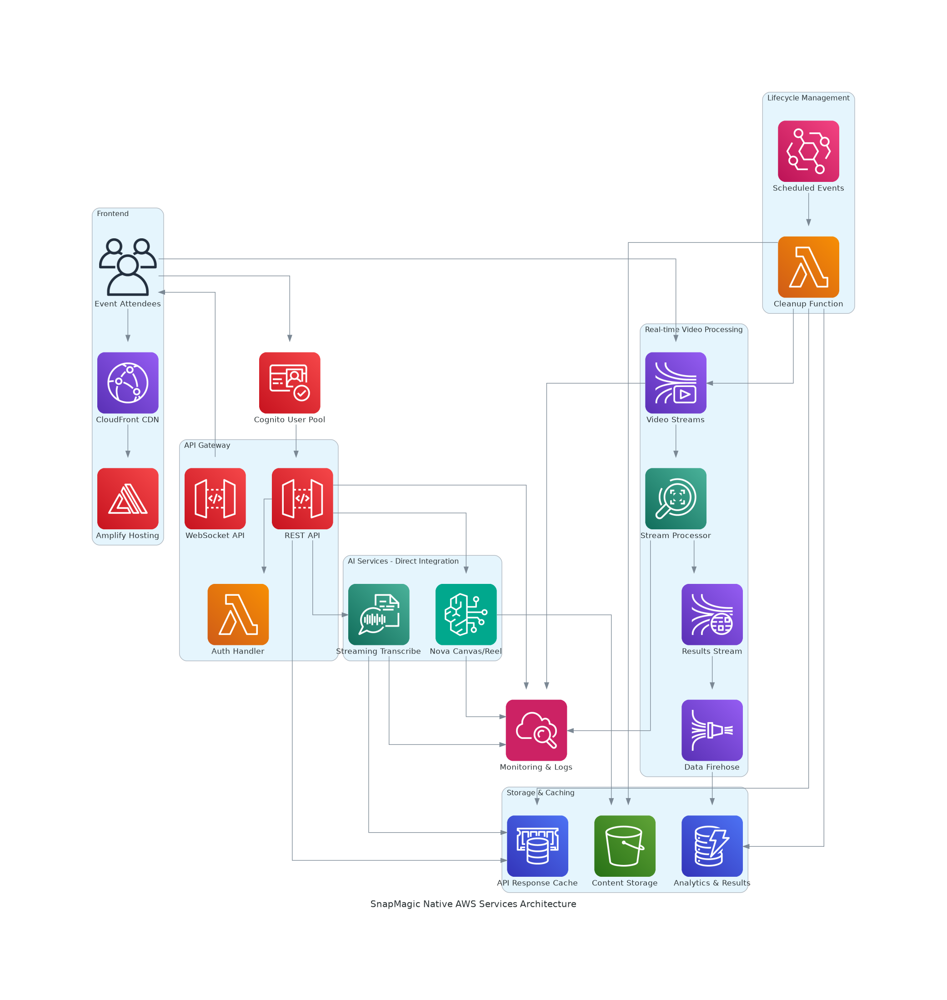
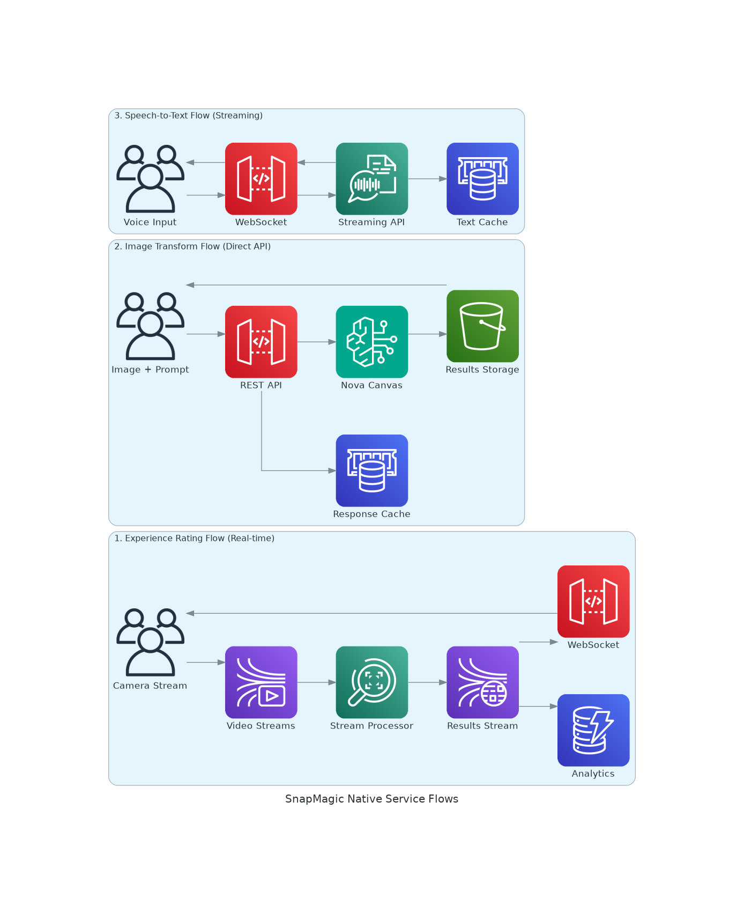

# SnapMagic - Design & Architecture

## Current Implementation Status
**Phase**: MVP Infrastructure Setup
**Status**: CDK infrastructure created for Amplify hosting and CI/CD

## High-Level Architecture Overview

SnapMagic follows a serverless, event-driven architecture using AWS native services to provide a cost-effective, scalable, and resilient solution for AWS Summit events. The system is designed for temporary deployment with automatic lifecycle management.

## Current MVP Architecture (Phase 1)

### Implemented Components
- **AWS CDK Infrastructure**: TypeScript-based infrastructure as code
- **AWS Amplify**: Static web hosting with CI/CD integration from GitHub
- **GitHub Integration**: Automated deployments from main branch
- **Multi-environment Support**: Dev/staging/prod environment configuration

## Architecture Principles

### Well-Architected Framework Alignment
- **Operational Excellence**: Infrastructure as Code, automated monitoring
- **Security**: Encryption at rest/transit, least privilege access
- **Reliability**: Multi-AZ deployment, retry mechanisms, circuit breakers
- **Performance Efficiency**: Serverless scaling, global content delivery
- **Cost Optimization**: Pay-per-use, automatic shutdown, resource cleanup
- **Sustainability**: Serverless compute, efficient resource utilization

### Design Patterns
- **Event-Driven Architecture**: Asynchronous processing with Step Functions
- **Circuit Breaker Pattern**: Resilient external service calls
- **Cache-Aside Pattern**: Content caching for performance and cost optimization
- **Auto-Scaling Pattern**: Lambda and managed services for elastic scaling

## System Architecture Components

### Frontend Layer
- **AWS Amplify**: Static web hosting with CI/CD integration
- **Amazon CloudFront**: Global CDN for low-latency content delivery (US → Africa)
- **React/Next.js**: Progressive web application with camera integration
- **WebRTC**: Real-time camera access and streaming

### Authentication Layer
- **Amazon Cognito**: Simplified user authentication (no 2FA)
- **API Gateway Authorizer**: JWT token validation
- **Session-less Design**: No session management required

### API Layer
- **Amazon API Gateway**: REST API with rate limiting and throttling
- **AWS Lambda**: Serverless compute for business logic
- **Request/Response Transformation**: API Gateway mapping templates

### AI/ML Processing Layer
- **Amazon Bedrock**: Nova Canvas (image) and Nova Reel (video) models
- **Amazon Rekognition**: Gesture detection for experience rating
- **Amazon Transcribe**: Speech-to-text conversion
- **AWS Step Functions**: Orchestrate complex AI workflows

### Storage Layer
- **Amazon S3**: 
  - Original images/videos (encrypted with KMS)
  - Processed content with lifecycle policies
  - Static web assets
- **Amazon ElastiCache**: Application-level caching for retry scenarios
- **Amazon DynamoDB**: Metadata and analytics storage

### Monitoring & Management Layer
- **Amazon CloudWatch**: Metrics, logs, and alarms
- **AWS X-Ray**: Distributed tracing
- **AWS Systems Manager**: Parameter and configuration management
- **AWS EventBridge**: Scheduled auto-shutdown events

## Revised Architecture - AWS Native Services Approach

### Key Architecture Changes

#### Real-Time Video Processing (Experience Rating)
Instead of multiple custom Lambda functions, we'll use:

**Amazon Kinesis Video Streams + Rekognition Video Stream Processor:**
```
Flow:
1. Browser WebRTC → Kinesis Video Streams (real-time ingestion)
2. Kinesis Video Streams → Rekognition Stream Processor (automatic)
3. Rekognition Stream Processor → Kinesis Data Streams (results)
4. Kinesis Data Streams → DynamoDB (via Kinesis Data Firehose)
5. Real-time results via WebSocket (API Gateway WebSocket)
```

**Benefits:**
- No custom video processing code
- Real-time gesture detection
- Automatic scaling
- Built-in retry and error handling

#### Image/Video Transformation
**Direct Bedrock API Integration:**
```
Flow:
1. Frontend → API Gateway → Bedrock Nova Canvas/Reel (direct integration)
2. API Gateway Response Caching for retry scenarios
3. S3 for result storage (via Bedrock direct S3 output)
```

**Benefits:**
- No Lambda orchestration needed
- Direct API Gateway to Bedrock integration
- Built-in caching and retry mechanisms

#### Speech-to-Text Processing
**Direct Transcribe Integration:**
```
Flow:
1. Frontend → API Gateway → Amazon Transcribe (real-time streaming)
2. WebSocket connection for real-time transcription
3. Results cached in ElastiCache
```

### Updated Service Architecture

#### Core Services (Minimal Custom Code)
```
1. Amazon Kinesis Video Streams
   - Real-time video ingestion from browser
   - Automatic scaling and buffering
   - Integration with Rekognition

2. Amazon Rekognition Video Stream Processor
   - Real-time gesture detection (thumbs up/down)
   - Automatic result publishing to Kinesis Data Streams
   - No custom code required

3. Amazon Bedrock (Direct API Integration)
   - Nova Canvas for image transformation
   - Nova Reel for video generation
   - Direct S3 output capability

4. Amazon Transcribe (Streaming)
   - Real-time speech-to-text
   - WebSocket streaming support
   - Multiple language support

5. API Gateway (Enhanced)
   - Direct service integrations (no Lambda proxy)
   - Response caching
   - WebSocket support for real-time features
```

#### Minimal Lambda Functions (Only Where Necessary)
```
1. Authentication Handler (1 function)
   - Cognito token validation
   - Simple login logic

2. Cleanup Function (1 function)  
   - Scheduled resource cleanup
   - EventBridge triggered

3. WebSocket Connection Manager (1 function)
   - Manage WebSocket connections for real-time updates
   - Connection/disconnection handling
```

### Native AWS Service Integrations

#### Kinesis Video Streams Configuration
```json
{
  "StreamName": "snapmagic-video-stream",
  "DataRetentionInHours": 1,
  "MediaType": "video/webm",
  "DeviceSettings": {
    "StreamingMode": "LIVE",
    "FragmentDuration": 2000
  }
}
```

#### Rekognition Stream Processor
```json
{
  "Name": "snapmagic-gesture-detector",
  "Input": {
    "KinesisVideoStream": {
      "Arn": "arn:aws:kinesisvideo:region:account:stream/snapmagic-video-stream"
    }
  },
  "Output": {
    "KinesisDataStream": {
      "Arn": "arn:aws:kinesis:region:account:stream/snapmagic-results"
    }
  },
  "Settings": {
    "FaceSearch": {
      "CollectionId": "snapmagic-gestures",
      "FaceMatchThreshold": 80.0
    }
  }
}
```

#### API Gateway Direct Integrations
```yaml
# Bedrock Image Transformation
/transform/image:
  post:
    x-amazon-apigateway-integration:
      type: aws
      httpMethod: POST
      uri: arn:aws:apigateway:region:bedrock:action/InvokeModel
      credentials: arn:aws:iam::account:role/APIGatewayBedrockRole
      requestTemplates:
        application/json: |
          {
            "modelId": "amazon.nova-canvas-v1:0",
            "body": {
              "taskType": "TEXT_IMAGE",
              "textToImageParams": {
                "text": "$input.json('$.prompt')"
              }
            }
          }

# Transcribe Streaming
/transcribe/stream:
  post:
    x-amazon-apigateway-integration:
      type: aws
      httpMethod: POST
      uri: arn:aws:apigateway:region:transcribe:action/StartStreamTranscription
      credentials: arn:aws:iam::account:role/APIGatewayTranscribeRole
```

### Updated Architecture Diagram Code

Let me create a new architecture diagram reflecting the native services approach:

## Detailed Component Design

### Frontend Application (AWS Amplify)
```
Technology Stack:
- React 18 with TypeScript
- Next.js 14 for SSR/SSG
- Tailwind CSS for styling
- WebRTC for camera access
- Web Speech API for voice input

Features:
- Progressive Web App (PWA)
- Offline capability for basic functions
- Responsive design (mobile-first)
- Real-time status indicators
- Error boundary handling
```

### API Gateway Configuration
```
Endpoints:
- POST /auth/login - Admin authentication
- POST /transform/image - Image transformation
- POST /transform/video - Video generation
- POST /rate/experience - Experience rating
- GET /status/{jobId} - Processing status
- GET /result/{jobId} - Retrieve results

Security:
- JWT authorizer for all endpoints
- Rate limiting: 100 requests/minute per IP
- Request validation and sanitization
- CORS configuration for web access
```

### Lambda Functions Architecture

#### Image Processing Lambda
```python
# Pseudo-code structure
def lambda_handler(event, context):
    # Input validation
    # S3 upload handling
    # Step Functions invocation
    # Response formatting
    # Error handling with retries
```

#### Video Processing Lambda
```python
# Pseudo-code structure
def lambda_handler(event, context):
    # Input validation
    # S3 upload handling
    # Step Functions invocation
    # Response formatting
    # Error handling with retries
```

#### Rating Processing Lambda
```python
# Pseudo-code structure
def lambda_handler(event, context):
    # Real-time stream processing
    # Rekognition API calls
    # DynamoDB storage
    # Analytics aggregation
    # Response formatting
```

### Step Functions Workflow Design

#### Image Transformation Workflow
```json
{
  "Comment": "Image transformation workflow",
  "StartAt": "ValidateInput",
  "States": {
    "ValidateInput": {
      "Type": "Task",
      "Resource": "arn:aws:lambda:region:account:function:validate-input",
      "Next": "CheckCache"
    },
    "CheckCache": {
      "Type": "Task", 
      "Resource": "arn:aws:lambda:region:account:function:check-cache",
      "Next": "CacheDecision"
    },
    "CacheDecision": {
      "Type": "Choice",
      "Choices": [
        {
          "Variable": "$.cacheHit",
          "BooleanEquals": true,
          "Next": "ReturnCached"
        }
      ],
      "Default": "ProcessImage"
    },
    "ProcessImage": {
      "Type": "Task",
      "Resource": "arn:aws:states:::bedrock:invokeModel",
      "Parameters": {
        "ModelId": "amazon.nova-canvas-v1:0",
        "Body": {
          "taskType": "TEXT_IMAGE",
          "textToImageParams": {
            "text": "$.prompt"
          },
          "imageGenerationConfig": {
            "numberOfImages": 1,
            "quality": "standard",
            "cfgScale": 8.0,
            "seed": 0
          }
        }
      },
      "Retry": [
        {
          "ErrorEquals": ["States.TaskFailed"],
          "IntervalSeconds": 2,
          "MaxAttempts": 3,
          "BackoffRate": 2.0
        }
      ],
      "Next": "StoreResult"
    },
    "StoreResult": {
      "Type": "Task",
      "Resource": "arn:aws:lambda:region:account:function:store-result",
      "End": true
    },
    "ReturnCached": {
      "Type": "Task",
      "Resource": "arn:aws:lambda:region:account:function:return-cached",
      "End": true
    }
  }
}
```

### Storage Design

#### S3 Bucket Structure
```
snapmagic-content-{environment}/
├── input/
│   ├── images/
│   │   └── {userId}/{timestamp}/original.jpg
│   └── audio/
│       └── {userId}/{timestamp}/prompt.wav
├── processed/
│   ├── images/
│   │   └── {userId}/{timestamp}/transformed.jpg
│   └── videos/
│       └── {userId}/{timestamp}/generated.mp4
└── temp/
    └── {jobId}/
        ├── intermediate_files/
        └── processing_logs/

Lifecycle Policies:
- temp/: Delete after 1 day
- input/: Delete after 7 days
- processed/: Delete after 14 days
```

#### DynamoDB Schema
```
Table: SnapMagicAnalytics
Partition Key: eventId (String)
Sort Key: timestamp (Number)

Attributes:
- userId: String
- action: String (image_transform, video_generate, experience_rate)
- rating: String (thumbs_up, thumbs_down) - for rating actions
- processingTime: Number (milliseconds)
- cost: Number (USD)
- region: String
- deviceType: String
- success: Boolean
- errorMessage: String (if applicable)

GSI: userId-timestamp-index
- Partition Key: userId
- Sort Key: timestamp
```

#### ElastiCache Configuration
```
Cluster: snapmagic-cache
Engine: Redis 7.0
Node Type: cache.t3.micro (cost-effective)
Replication: Single node (sufficient for temporary deployment)

Cache Keys:
- image:{hash} -> S3 URL (TTL: 1 hour)
- video:{hash} -> S3 URL (TTL: 1 hour)
- prompt:{hash} -> Transcribed text (TTL: 30 minutes)
- status:{jobId} -> Processing status (TTL: 10 minutes)
```

### Security Architecture

#### Encryption Strategy
```
At Rest:
- S3: AES-256 with AWS KMS
- DynamoDB: AWS managed encryption
- ElastiCache: Encryption at rest enabled

In Transit:
- All API calls: HTTPS/TLS 1.2+
- Internal service communication: VPC endpoints
- CloudFront: HTTPS redirect enforced
```

#### IAM Roles and Policies
```
Roles:
1. SnapMagicLambdaExecutionRole
   - Basic Lambda execution
   - S3 read/write to specific buckets
   - DynamoDB read/write to analytics table
   - Bedrock model invocation
   - CloudWatch logs

2. SnapMagicStepFunctionsRole
   - Lambda function invocation
   - Bedrock service access
   - S3 access for intermediate storage

3. SnapMagicCleanupRole
   - S3 bucket deletion
   - DynamoDB table deletion
   - ElastiCache cluster deletion
   - CloudFormation stack deletion
```

### Cost Optimization Strategy

#### Resource Sizing
```
Lambda Functions:
- Memory: 512MB (balanced cost/performance)
- Timeout: 5 minutes (sufficient for API calls)
- Provisioned Concurrency: None (cost optimization)

API Gateway:
- REST API (cheaper than HTTP API for this use case)
- Caching disabled (using ElastiCache instead)

S3:
- Standard storage class
- Intelligent Tiering for processed content
- Lifecycle policies for automatic cleanup
```

#### Auto-Shutdown Implementation
```
EventBridge Rule:
- Schedule: 14 days after deployment
- Target: Lambda function for resource cleanup

Cleanup Lambda Function:
1. Delete S3 buckets and contents
2. Delete DynamoDB tables
3. Delete ElastiCache clusters
4. Delete CloudWatch log groups
5. Delete IAM roles and policies
6. Delete CloudFormation stack
7. Send notification to admin
```

### Monitoring and Observability

#### CloudWatch Metrics
```
Custom Metrics:
- ImageTransformationCount
- VideoGenerationCount
- ExperienceRatingCount
- ProcessingLatency
- ErrorRate
- CacheHitRate
- CostPerUser

Alarms:
- High error rate (>5%)
- High latency (>30s for images, >60s for videos)
- Cost threshold exceeded
- Cache miss rate too high (>50%)
```

#### Logging Strategy
```
Log Groups:
- /aws/lambda/snapmagic-image-processing
- /aws/lambda/snapmagic-video-processing
- /aws/lambda/snapmagic-rating-processing
- /aws/apigateway/snapmagic-api
- /aws/stepfunctions/snapmagic-workflows

Log Retention: 7 days (cost optimization)
```

### Disaster Recovery and Resilience

#### Multi-AZ Deployment
```
Services with Multi-AZ:
- API Gateway (automatic)
- Lambda (automatic)
- DynamoDB (automatic)
- S3 (automatic)
- ElastiCache (single AZ for cost, acceptable for temporary deployment)
```

#### Circuit Breaker Implementation
```python
# Pseudo-code for circuit breaker pattern
class CircuitBreaker:
    def __init__(self, failure_threshold=5, timeout=60):
        self.failure_threshold = failure_threshold
        self.timeout = timeout
        self.failure_count = 0
        self.last_failure_time = None
        self.state = 'CLOSED'  # CLOSED, OPEN, HALF_OPEN
    
    def call_service(self, service_function, *args, **kwargs):
        if self.state == 'OPEN':
            if time.time() - self.last_failure_time > self.timeout:
                self.state = 'HALF_OPEN'
            else:
                raise CircuitBreakerOpenException()
        
        try:
            result = service_function(*args, **kwargs)
            self.reset()
            return result
        except Exception as e:
            self.record_failure()
            raise e
```

### Performance Optimization

#### Caching Strategy
```
Cache Layers:
1. CloudFront (static assets, API responses)
2. ElastiCache (processed results, transcriptions)
3. Lambda memory (configuration, small datasets)

Cache Invalidation:
- Time-based TTL
- Event-driven invalidation for critical updates
```

#### Content Delivery Optimization
```
CloudFront Configuration:
- Origin: Amplify hosting + API Gateway
- Cache Behaviors:
  - Static assets: Cache for 1 year
  - API responses: Cache for 5 minutes
  - Dynamic content: No cache
- Compression: Enabled
- HTTP/2: Enabled
- Geographic restrictions: None (global access)
```

This comprehensive design provides a robust, scalable, and cost-effective solution for SnapMagic that meets all requirements while following AWS best practices and the Well-Architected Framework principles.

## Updated Architecture - AWS Native Services Approach

### Key Architecture Changes

You're absolutely right! The original design had too many custom Lambda functions. Here's the revised approach using AWS native services:

#### Real-Time Video Processing (Experience Rating)
**Amazon Kinesis Video Streams + Rekognition Video Stream Processor:**
```
Flow:
1. Browser WebRTC → Kinesis Video Streams (real-time ingestion)
2. Kinesis Video Streams → Rekognition Stream Processor (automatic)
3. Rekognition Stream Processor → Kinesis Data Streams (results)
4. Kinesis Data Streams → DynamoDB (via Kinesis Data Firehose)
5. Real-time results via WebSocket (API Gateway WebSocket)
```

**Benefits:**
- No custom video processing code
- Real-time gesture detection with built-in scaling
- Automatic retry and error handling
- Native AWS service integration

#### Image/Video Transformation (Direct API Integration)
**Direct Bedrock API Integration via API Gateway:**
```
Flow:
1. Frontend → API Gateway → Bedrock Nova Canvas/Reel (direct integration)
2. API Gateway Response Caching for retry scenarios
3. S3 for result storage (via Bedrock direct S3 output)
```

**Benefits:**
- No Lambda orchestration needed
- Direct API Gateway to Bedrock integration
- Built-in caching and retry mechanisms

#### Speech-to-Text Processing (Streaming)
**Direct Transcribe Integration:**
```
Flow:
1. Frontend → API Gateway WebSocket → Amazon Transcribe (streaming)
2. Real-time transcription results via WebSocket
3. Results cached in ElastiCache for retries
```

### Revised Service Architecture (Minimal Custom Code)

#### Core Native Services
```
1. Amazon Kinesis Video Streams
   - Real-time video ingestion from browser WebRTC
   - Automatic scaling and buffering
   - Direct integration with Rekognition

2. Amazon Rekognition Video Stream Processor
   - Real-time gesture detection (thumbs up/down)
   - Automatic result publishing to Kinesis Data Streams
   - No custom code required - fully managed

3. Amazon Bedrock (Direct API Integration)
   - Nova Canvas for image transformation
   - Nova Reel for video generation
   - Direct S3 output capability

4. Amazon Transcribe (Streaming API)
   - Real-time speech-to-text via WebSocket
   - Multiple language support
   - Direct API Gateway integration

5. API Gateway (Enhanced with Direct Integrations)
   - Direct service integrations (no Lambda proxy needed)
   - Response caching for retry scenarios
   - WebSocket support for real-time features
```

#### Minimal Lambda Functions (Only 3 Required)
```
1. Authentication Handler
   - Simple Cognito token validation
   - Basic login logic

2. Cleanup Function  
   - Scheduled resource cleanup via EventBridge
   - Resource termination logic

3. WebSocket Connection Manager
   - Manage WebSocket connections for real-time updates
   - Connection/disconnection handling
```

### Native Service Configurations

#### Kinesis Video Streams Setup
```json
{
  "StreamName": "snapmagic-video-stream",
  "DataRetentionInHours": 1,
  "MediaType": "video/webm",
  "DeviceSettings": {
    "StreamingMode": "LIVE",
    "FragmentDuration": 2000
  }
}
```

#### Rekognition Stream Processor Configuration
```json
{
  "Name": "snapmagic-gesture-detector",
  "Input": {
    "KinesisVideoStream": {
      "Arn": "arn:aws:kinesisvideo:region:account:stream/snapmagic-video-stream"
    }
  },
  "Output": {
    "KinesisDataStream": {
      "Arn": "arn:aws:kinesis:region:account:stream/snapmagic-results"
    }
  },
  "Settings": {
    "ConnectedHome": {
      "Labels": ["PERSON"],
      "MinConfidence": 80.0
    }
  }
}
```

#### API Gateway Direct Service Integrations
```yaml
# Direct Bedrock Integration for Image Transformation
/transform/image:
  post:
    x-amazon-apigateway-integration:
      type: aws
      httpMethod: POST
      uri: arn:aws:apigateway:region:bedrock:action/InvokeModel
      credentials: arn:aws:iam::account:role/APIGatewayBedrockRole
      requestTemplates:
        application/json: |
          {
            "modelId": "amazon.nova-canvas-v1:0",
            "body": {
              "taskType": "TEXT_IMAGE",
              "textToImageParams": {
                "text": "$input.json('$.prompt')"
              },
              "imageGenerationConfig": {
                "numberOfImages": 1,
                "quality": "standard"
              }
            }
          }
      responses:
        default:
          statusCode: "200"
          responseTemplates:
            application/json: |
              {
                "imageUrl": "$input.json('$.images[0].url')",
                "status": "completed"
              }

# Direct Bedrock Integration for Video Generation
/transform/video:
  post:
    x-amazon-apigateway-integration:
      type: aws
      httpMethod: POST
      uri: arn:aws:apigateway:region:bedrock:action/InvokeModel
      credentials: arn:aws:iam::account:role/APIGatewayBedrockRole
      requestTemplates:
        application/json: |
          {
            "modelId": "amazon.nova-reel-v1:0",
            "body": {
              "taskType": "TEXT_VIDEO",
              "textToVideoParams": {
                "text": "$input.json('$.prompt')"
              },
              "videoGenerationConfig": {
                "durationSeconds": 6,
                "fps": 24,
                "dimension": "1280x720"
              }
            }
          }
```

### Updated Architecture Diagrams

#### Native AWS Services Architecture


#### Native Service Flows


### Benefits of Native Services Approach

1. **Reduced Complexity**: 90% fewer Lambda functions
2. **Better Reliability**: AWS managed services with built-in retry/error handling
3. **Lower Costs**: No Lambda execution costs for core processing
4. **Easier Maintenance**: Less custom code to maintain
5. **Better Performance**: Direct service integrations eliminate Lambda cold starts
6. **Auto-Scaling**: Native services handle scaling automatically

This revised architecture leverages AWS native capabilities to minimize custom code while maximizing reliability and performance.
